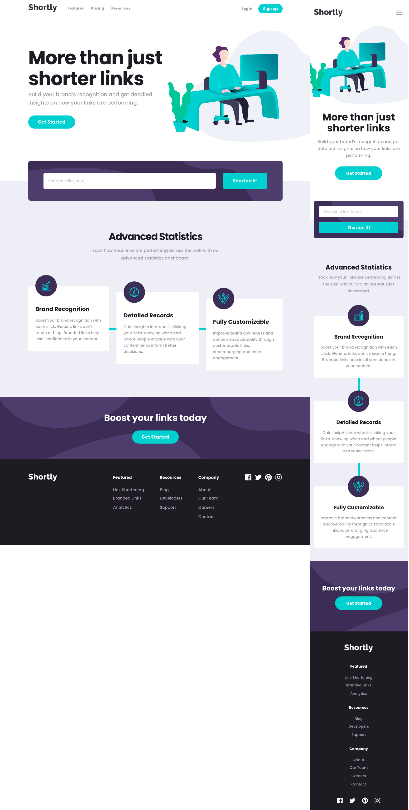

# Frontend Mentor - Shortly URL shortening API Challenge solution

This is a solution to the [Shortly URL shortening API Challenge challenge on Frontend Mentor](https://www.frontendmentor.io/challenges/url-shortening-api-landing-page-2ce3ob-G). Frontend Mentor challenges help you improve your coding skills by building realistic projects.

## Overview

### The challenge

Users should be able to:

- View the optimal layout for the site depending on their device's screen size
- Shorten any valid URL
- See a list of their shortened links, even after refreshing the browser
- Copy the shortened link to their clipboard in a single click
- Receive an error message when the `form` is submitted if:
  - The `input` field is empty

### Screenshot

### Links

- [Solution](https://www.frontendmentor.io/solutions/url-shortening-api-landing-page-3fogGHwJ3)
- [Live Site](https://filippo-b.github.io/url-shortening-api/)

## My process

### Built with

- Semantic HTML5 markup
- CSS custom properties
- Flexbox
- Mobile-first workflow
- [Clipboard JS](https://clipboardjs.com/)
- [Animate CSS](https://animate.style/)

### Useful resources

- [Understanding Promises and Async Await in JavaScript](https://youtu.be/2Ur9X4tUI9Y) - Great explanation of JS promises and async/await by Swashbuckling with Code.

## Author

- Frontend Mentor - [@Filippo-B](https://www.frontendmentor.io/profile/Filippo-B)
